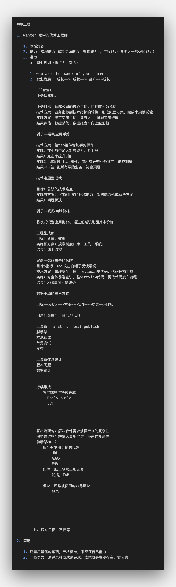
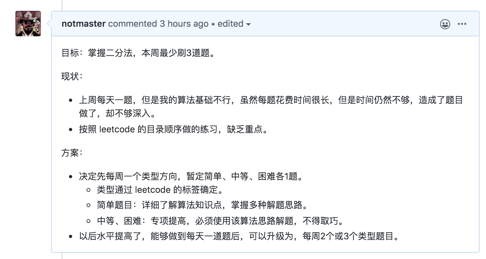

# 第1周学习总结

[TOC]

## 1.课堂学习

本周上了3节课：学习方法、构建知识体系、工程体系。
这些框架性质的内容，后续还会随着学习的不断深入持续总结补充。

### 课堂内容摘要

#### 1.重学|学习方法

**参考链接：**
https://www.w3.org/
http://w3school.com/
https://whatwg.org/
https://scholar.google.com/
https://developer.mozilla.org/
https://docs.microsoft.com/
https://developer.apple.com/

**随堂作业：**
把面向对象这个概念用追溯法写一篇博文，写在自己的博客中，例如：博客园、稀土、掘金等，不限平台；你也可以写到 GitHub 的 Issues 里。把链接发到班级群里，跟大家分享。（不作为日常作业统计）
把预习内容的前端目录整理出来，和 winter 老师课件里的脑图或者课程目录做对比，思考一下为什么会有差别？

**讲师提到的名词：**
QCon：全球软件开发大会（ https://qcon.infoq.cn/2020/beijing/）
Closure：闭包（ https://en.wikipedia.org/wiki/Closure_(computer_programming) ）

#### 2.重学|构建知识体系

**主要参考网站：**
https://www.ecma-international.org/
https://developer.mozilla.org/en-US/docs/Web
https://whatwg.org/

**课上涉及网址：**
https://www.ecma-international.org/publications/files/ECMA-ST/ECMA-262.pdf
https://www.w3school.com.cn/html/html_entities.asp
https://www.w3.org/1999/xhtml/
https://html.spec.whatwg.org/multipage/
https://developer.mozilla.org/zh-CN/docs/Web/HTML/Element

**参考文件(已转存)：**
前端技术 2.xmind
ECMA-262.pdf
html-standard.pdf

**参考名词：**
XMind：思维导图软件（ https://www.xmind.cn/）
DTD：Document Type Definition（ https://www.w3.org/TR/xhtml1/DTD/xhtml1-strict.dtd）
Entity：实体（在 HTML 语境下就是 & 符后边的东西）
ARIA：Accessible Rich Internet Applications（ https://www.w3.org/TR/html-aria/）
Token：有效的输入元素
Comment：注释
WhiteSpace：空白符
Line Terminator：行终止符
Atom：原子
Semantics：语义
Runtime：运行时

**其他有助于你理解的知识（选看）：**
计算机组成原理
操作系统
编译原理

**学员给出的课上参考代码：**
Array.prototype.map.call($0.querySelectorAll(‘code’), e => e.innerText).join(’\n’)

#### 3. 重学|工程体系

**参考链接：**
https://fed.taobao.org/blog/taofed/do71ct/fed-learning-quizzes-apply/?spm=taofed.blogs.blog-list.9.44fe5ac8p6qg66
https://tools.ietf.org/html/rfc3986
https://svn.apache.org/repos/asf/labs/webarch/trunk/uri/rev-2002/issues.html
https://tools.ietf.org/
https://github.com/spritejs/spritejs
https://spritejs.org/#/

**随堂作业：**
把库里边的 URL 解析代码写一下

**参考名词：**
UV：（Unique Visitor）独立访客，统计 1 天内访问某站点的用户数 (以 cookie 为依据)，如果清除了 cookies 或者更换设备访问，计数会加 1。按用户算的，比较真实一点。
PV：（Page View）访问量, 即页面浏览量或点击量，在一定统计周期内用户每打开或刷新一个页面就记录 1 次。
ctr：点击率（click-through rate）
判断用户活跃度：日活除以月活
CICD：持续集成 (Continuous Integration) 和持续部署 (Continuous Deployment) 简称。
SpriteJS：是跨平台的高性能图形系统，它能够支持 web、node、桌面应用和小程序的图形绘制和实现各种动画效果。
前端之巅：InfoQ 旗下关注大前端的技术社群
龙书：《编译原理》

### 其他参考

- [150天数据结构与算法学习计划](https://www.yuque.com/change-zym9v/tae2h4/ory27h)
- [温故而知新 -- 重学前端第一步](https://juejin.im/post/5e92ecfe51882573b569bc92)

## 2.算法训练小组

详见：[本周总结&下周计划](https://github.com/JTDI/leetcode-practice/issues/5#issuecomment-613289005)

