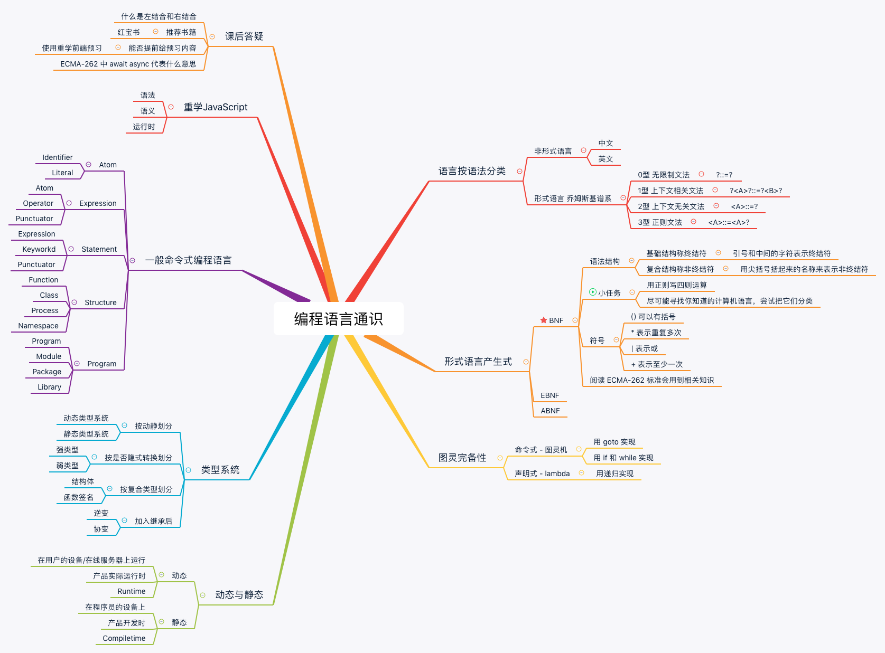
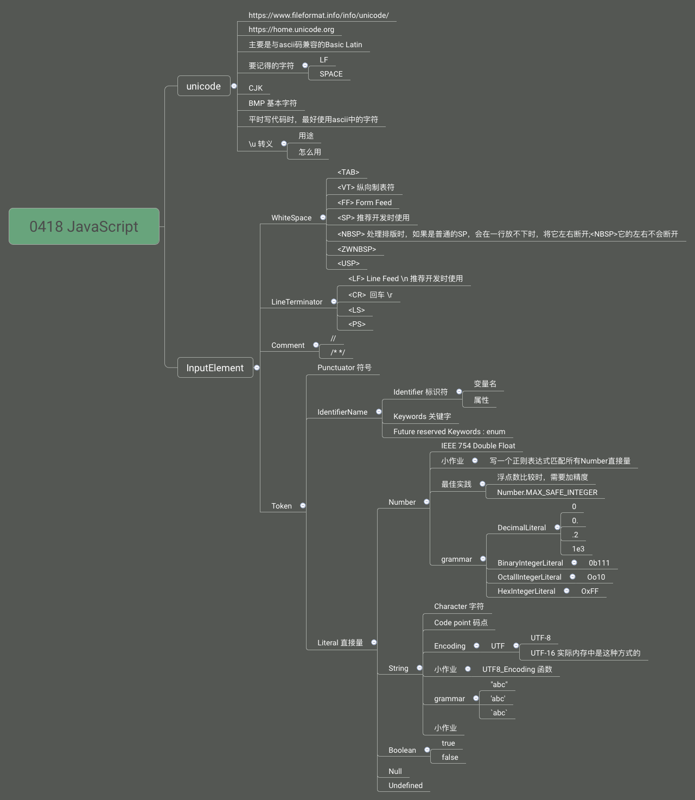
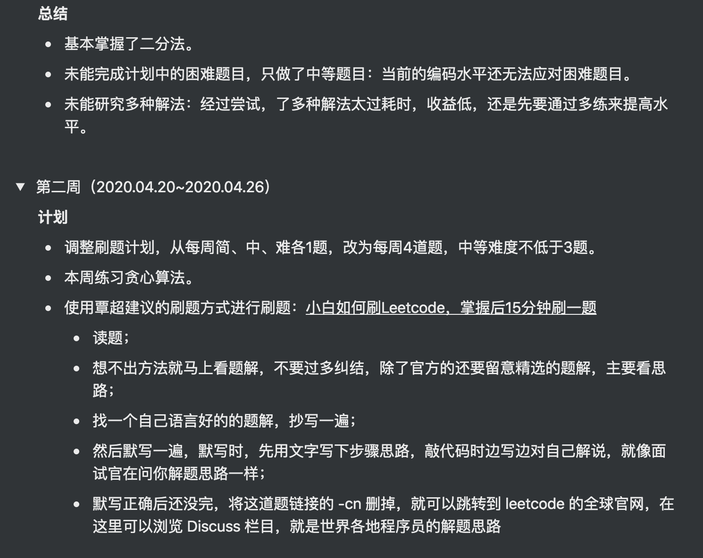

# 第2周学习总结

[TOC]

## 1. 重学 JavaScript | 编程语言通识与JavaScript语言设计

### 参考名词：

- 乔姆斯基谱系
	是计算机科学中刻画形式文法表达能力的一个分类谱系，是由诺姆·乔姆斯基于 1956 年提出的。它包括四个层次：
- 0- 型文法（无限制文法或短语结构文法）包括所有的文法。
  - 1- 型文法（上下文相关文法）生成上下文相关语言。
  - 2- 型文法（上下文无关文法）生成上下文无关语言。
  - 3- 型文法（正规文法）生成正则语言。
  
- [Brainfuck ](https://zh.wikipedia.org/wiki/Brainfuck)：一种极小化的程序语言，它是由 Urban Müller 在 1993 年创造的。由于 fuck 在英语中是脏话，这种语言有时被称为 Brainf*ck 或 Brainf***，或被简称为 BF。

- [巴科斯诺尔范式](https://zh.wikipedia.org/wiki/巴科斯范式)：即巴科斯范式（英语：Backus Normal Form，缩写为 BNF）是一种用于表示上下文无关文法的语言，上下文无关文法描述了一类形式语言。它是由约翰·巴科斯（John Backus）和彼得·诺尔（Peter Naur）首先引入的用来描述计算机语言语法的符号集。
  -[ 图灵机（Turing machine）](https://zh.wikipedia.org/wiki/图灵机)：又称确定型图灵机，是英国数学家艾伦·图灵于 1936 年提出的一种将人的计算行为抽象掉的数学逻辑机，其更抽象的意义为一种计算模型，可以看作等价于任何有限逻辑数学过程的终极强大逻辑机器。

- [图灵完备性](https://zh.wikipedia.org/wiki/圖靈完備性)：在可计算性理论里，如果一系列操作数据的规则（如指令集、编程语言、细胞自动机）可以用来模拟单带图灵机，那么它是图灵完全的。这个词源于引入图灵机概念的数学家艾伦·图灵。虽然图灵机会受到储存能力的物理限制，图灵完全性通常指“具有无限存储能力的通用物理机器或编程语言”。

- [Bjarne Stroustrup（比雅尼·斯特劳斯特鲁普）](https://zh.wikipedia.org/wiki/比雅尼·斯特劳斯特鲁普)：1950 年 12 月 30 日生于丹麦奥胡斯郡，计算机科学家。他以创造 C++ 编程语言而闻名，被称为“C++ 之父”。

### 有助于你理解的知识：

- 终结符： 最终在代码中出现的字符（[ https://zh.wikipedia.org/wiki/ 終結符與非終結符）](https://zh.wikipedia.org/wiki/終結符與非終結符）)
- 产生式： 在计算机中指 Tiger 编译器将源程序经过词法分析（Lexical Analysis）和语法分析（Syntax Analysis）后得到的一系列符合文法规则（Backus-Naur Form，BNF）的语句
- 静态和动态语言：[ https://www.cnblogs.com/raind/p/8551791.html](https://www.cnblogs.com/raind/p/8551791.html)
- 强类型： 无隐式转换
- 弱类型： 有隐式转换
- 协变与逆变：[ https://jkchao.github.io/typescript-book-chinese/tips/covarianceAndContravariance.html](https://jkchao.github.io/typescript-book-chinese/tips/covarianceAndContravariance.html)
- Yacc 与 Lex 快速入门：[ https://www.ibm.com/developerworks/cn/linux/sdk/lex/index.html](https://www.ibm.com/developerworks/cn/linux/sdk/lex/index.html)
- 关于元编程：[ https://www.zhihu.com/question/23856985](https://www.zhihu.com/question/23856985)
- 编程语言的自举：[ https://www.cnblogs.com/lidyan/p/6727184.html](https://www.cnblogs.com/lidyan/p/6727184.html)
- 推荐阅读：ECMA-262 Grammar Summary 部分

### 笔记总结：

#### 按语法分类

- 非形式语言
  - 中文
- 形式语言
  - 0型: 无限制文法
    - 等号左边不止一个` <a><b> ::= "c"`
  - 1型: 上下文相关文法
    - `"a"<b>"c"::="a""x""c"`
  - 2型: 上下文无关文法
    - js, 大部分情况是上下文无关
  - 3型: 正则文法
    - 限制表达能力

#### 产生式 BNF

练习:

```
"a"
"b"
<Program>: = ("a"+ | <Program> "b"+)+


整数连加
"+"
<Number>: "0" | "1" ... "9"
<Deciamal>: "0" | (("1" ~ "9") <Number>+)
<Expression>: <Deciamal> ("+" <Deciamal>)+
<Expression>: Deciamal | (<Expression> "+" <Deciamal>)

四则运算
<PrimaryExpression> = <DecimalNumber> |
"(" <LogicalExpression> ")"


<MultiplicativeExpression> = <PrimaryExpression> |
<MultiplicativeExpression> "*" <PrimaryExpression>|
<MultiplicativeExpression> "/" <PrimaryExpression>


<AdditiveExpression> = <MultiplicativeExpression> |
<AdditiveExpression> "+" <MultiplicativeExpression>|
<AdditiveExpression> "-" <MultiplicativeExpression>

逻辑判断
<LogicalExpression> = <AdditiveExpression> |
<LogicalExpression> "||" <AdditiveExpression> |
<LogicalExpression> "&&" <AdditiveExpression>

```

终结符, 如: "+"
非终结符: 如:  <LogicalExpression>

正则的回溯指的是什么

#### 图灵完备性

[wiki](https://zh.wikipedia.org/wiki/%E5%9C%96%E9%9D%88%E5%AE%8C%E5%82%99%E6%80%A7)

- 命令式 -- 图灵机
  - goto
  - if while
- 声明式 -- lambda
  - 递归
  - 分治

#### 类型系统

- 动态静态
- 强类型弱类型
- 复合类型
- 子类型
  - 逆变/协变

#### 思维导图




## 2. 重学 JavaScript | 词法，类型

### 参考链接：

- 讲师提供：
  - https://home.unicode.org/
  - https://www.fileformat.info/info/unicode/
- 学员提供：
  - 计算浮点数的一个工具：[ https://github.com/camsong/blog/issues/9](https://github.com/camsong/blog/issues/9)
- 有助于你理解的知识：
  - 正则表达式：[ https://developer.mozilla.org/zh-CN/docs/Web/JavaScript/Guide/Regular_Expressions](https://developer.mozilla.org/zh-CN/docs/Web/JavaScript/Guide/Regular_Expressions)
  - 揭秘 0.1 + 0.2 != 0.3 https://www.barretlee.com/blog/2016/09/28/ieee754-operation-in-js/
  - ASCII，Unicode 和 UTF-8 ：[ http://www.ruanyifeng.com/blog/2007/10/ascii_unicode_and_utf-8.html](http://www.ruanyifeng.com/blog/2007/10/ascii_unicode_and_utf-8.html)

### 参考名词：

- [字符集](https://zh.wikipedia.org/zh/字符编码)：字符编码（英语：Character encoding）、字集码是把字符集中的字符编码为指定集合中某一对象（例如：比特模式、自然数序列、8 位组或者电脉冲），以便文本在计算机中存储和通过通信网络的传递。常见的例子包括将拉丁字母表编码成摩斯电码和 ASCII。其中，ASCII 将字母、数字和其它符号编号，并用 7 比特的二进制来表示这个整数。通常会额外使用一个扩充的比特，以便于以 1 个字节的方式存储。在计算机技术发展的早期，如 ASCII（1963 年）和 EBCDIC（1964 年）这样的字符集逐渐成为标准。但这些字符集的局限很快就变得明显，于是人们开发了许多方法来扩展它们。对于支持包括东亚 CJK 字符家族在内的写作系统的要求能支持更大量的字符，并且需要一种系统而不是临时的方法实现这些字符的编码。
- [Unicode ](https://zh.wikipedia.org/zh-hans/Unicode)：中文：万国码、国际码、统一码、单一码。是计算机科学领域里的一项业界标准。它对世界上大部分的文字系统进行了整理、编码，使得电脑可以用更为简单的方式来呈现和处理文字。
- [ASCII ](https://zh.wikipedia.org/wiki/ASCII)：（American Standard Code for Information Interchange，美国信息交换标准代码）是基于拉丁字母的一套电脑编码系统。它主要用于显示现代英语，而其扩展版本延伸美国标准信息交换码则可以部分支持其他西欧语言，并等同于国际标准 ISO/IEC 646。美国信息交换标准代码是这套编码系统的传统命名，互联网号码分配局现在更倾向于使用它的新名字 US-ASCII[2]。美国信息交换标准代码是美国电气和电子工程师协会里程碑之一。
- Token：记号、标记。JS 里有效的输入元素都可以叫 Token。
- [NBSP ](https://zh.wikipedia.org/wiki/不换行空格)：不换行空格（英语：no-break space，NBSP）是空格字符，用途是禁止自动换行。HTML 页面显示时会自动合并多个连续的空白字符（whitespace character），但该字符是禁止合并的，因此该字符也称作“硬空格”（hard space、fixed space）。Unicode 码点为：U+00A0 no-break space。
- [零宽空格](https://zh.wikipedia.org/zh-hans/零宽空格)：（zero-width space, ZWSP）是一种不可打印的 Unicode 字符，用于可能需要换行处。在 HTML 页面中，零宽空格可以替代。但是在一些网页浏览器（例如 Internet Explorer 的版本 6 或以下）不支持零宽空格的功能。

### 笔记总结：

#### 预备知识：[unicode](https://www.fileformat.info/info/unicode/) 字符集 [中文字符](https://www.fileformat.info/info/unicode/block/cjk_unified_ideographs/index.htm)

- [Blocks](https://www.fileformat.info/info/unicode/block/index.htm) 编码组

  - 0 ~ U+007F：常用拉丁字符
    - `String.fromCharCode(num)`
  - U+4E00 ~ U+9FFF：CJK ChineseJapaneseKorean三合一
    - 有一些增补区域（extension）
  - U+0000 - U+FFFF：[BMP]([https://zh.wikipedia.org/wiki/Unicode%E5%AD%97%E7%AC%A6%E5%B9%B3%E9%9D%A2%E6%98%A0%E5%B0%84](https://zh.wikipedia.org/wiki/Unicode字符平面映射)) 基本平面

- [Categories](https://www.fileformat.info/info/unicode/category/index.htm)

  - [space空格系列](https://www.fileformat.info/info/unicode/category/Zs/list.htm)

- 实践

  - 中文变量名

    因涉及到文件的编码保存方式，使用 `\u十六进制unicode`转译（`'厉'.codeCodeAt().toString(16)`）

#### Atom 词

##### InputElement

- whiteSpace

  可查阅 unicode [space列表](https://www.fileformat.info/info/unicode/category/Zs/list.htm)

  - Tab：制表符（打字机时代：制表时隔开数字很方便）
  - VT：纵向制表符
  - FF: FormFeed
  - SP: Space
  - NBSP: NO-BREAK SPACE（和 SP 的区别在于不会断开、不会合并）
  - ...

- LineTerminator 换行符

  - LF: Line Feed `\n`
  - CR: Carriage Return `\r`
  - ...

- Comment 注释

- Token 记号：一切有效的东西

  - Punctuator: 符号 比如 `> = < }`
  - Keywords：比如 `await`、`break`... 不能用作变量名，但像 getter 里的 `get`就是个例外
    - Future reserved Keywords: `eum`
  - IdentifierName：标识符，可以以字母、_ 或者 $ 开头，代码中用来标识**[变量](https://developer.mozilla.org/en-US/docs/Glossary/variable)、[函数](https://developer.mozilla.org/en-US/docs/Glossary/function)、或[属性](https://developer.mozilla.org/en-US/docs/Glossary/property)**的字符序列
    - 变量名：不能用 Keywords
    - 属性：可以用 Keywords
  - Literal: 直接量
    - Number
      - 存储 Uint8Array、Float64Array
      - 各种进制的写法
        - 二进制0b
        - 八进制0o
        - 十进制0x
      - 实践
        - 比较浮点是否相等：Math.abs(0.1 + 0.2 - 0.3) <= Number.EPSILON
        - 如何快捷查看一个数字的二进制：(97).toString(2)
    - String
      - Character
      - Code Point
      - Encoding
        - unicode编码 - utf
          - utf-8 可变长度 （控制位的用处）
      - Grammar
        - `''`、`""`、``` `
    - Boolean
    - Null
    - Undefind

### 思维导图：



## 3.本周作业

- 写一个正则表达式 匹配所有 Number 直接量
- 写一个 UTF-8 Encoding 的函数
- 写一个正则表达式，匹配所有的字符串直接量，单引号和双引号

解题详见：[作业.js](./作业.js)

## 4.算法训练小组

本周总结&下周计划详情：https://www.notion.so/0d596f26a24d4ae9b22e8268fca5816d



