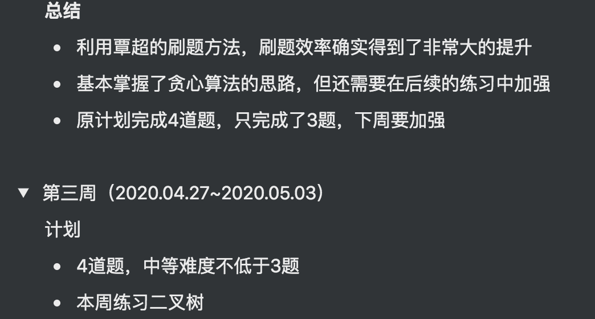

# 第3周学习总结

[TOC]

## 1.重学 JavaScript | 表达式，类型转换

### 参考链接：

- 讲师提供：
  - https://jsfiddle.net/pLh8qeor/19/
- 学员提供：
  - 运算符优先级：[ https://developer.mozilla.org/zh-CN/docs/Web/JavaScript/Reference/Operators/Operator_Precedence](https://developer.mozilla.org/zh-CN/docs/Web/JavaScript/Reference/Operators/Operator_Precedence)

### 参考名词：

- LeftHandSideExpression：ECMA-262.pdf 201 页 12.3
- UpdateExpression：ECMA-262.pdf 178 页 11.9.1
- [IIFE ](https://zh.wikipedia.org/wiki/立即调用函数表达式)：Immediately-invoked Function Expressions 立即执行的函数表达式

### 笔记

#### 有效数字

判断数字符号

```
function sign(number) {
	if(1/number === Infinity) {
    return 1;
  }
  if(1/number === -Infinity) {
    return -1;
  }
  return number / Math.abs(number);
}
```

浮点数尽量不要做算数运算，考虑精度丢失的影响。

#### Expression

##### Left Handside & Right Handside

 Left Handside (赋值操作的目标) Reference 引用

 Right Handside (赋值操作的来源)

##### Left Handside

运算符

表达式树结构 => 表达式优先级

- Member

  ```
  a.b
  a[b]
  foo`string` // styles-compontents
  super.b
  super[b]
  new.target // 判断函数是否是new调用
  new Foo()
  ```

- New

  new Foo

- Call

  ```
  foo()
  super()
  foo()[b]
  foo().b
  foo()`string`
  ```

##### Right Handside

- Update

  ```
  a++
  a--
  --a
  ++a
  ```

- Unary

  ```
  delete a.b
  void 0; // 生成undefined
  typeof a
  +a
  -a
  ~a
  !a // !!a 转换为boolean值
  await a
  ```

- Exponental

  **

- Multiplicative

  \* / %

- Additive

  - - 

- Shift

  << >> >>>

- Relationship

  < > <= >= instanceof in

- Equality

  ```
  ==
  !=
  ===
  !==
  ```

- Bitwise 位运算

  & ^ |

- Logical

  && ||

  短路逻辑

  ```
  a && b  a为true时，b才会执行
  a || b  a或b为true，a或b才会执行
  ```

- Conditional

  ? :

##### 类型转换

- 基础类型

  - Undefined
  - Boolean
  - String
  - Number
  - Null
  - Symbol
  - BigInt
  - Object

- 装箱拆箱

  装箱：基础类型 => 包装类型 `Boolean String Boolean ...`

  拆箱：包装类型(Object) => 基础类型, 会优先调用`valueOf toString toPrimitive`进行转换

- 类型的判断

  - typeof
  - Obejct.prototype.toString.call
  - instanceof

- 隐式转换发生的场景

  - Left Handside Right Handside

    左右取值，转换为原始值，如果转换后的值存在string, 则进行toString后拼接。否则按toNumber处理

  - ==

    优先按照number处理

  - if

    优先按照boolean处理

  - 数学运算符

    优先转换非number为number


## 2.重学 JavaScript | 语句，对象

### 有助于你理解的知识：

- 按照 ECMAScript 标准，一些特定语句（statement) 必须以分号结尾。分号代表这段语句的终止。但是有时候为了方便，这些分号是有可以省略的。这种情况下解释器会自己判断语句该在哪里终止。这种行为被叫做 “自动插入分号”，简称 ASI (Automatic Semicolon Insertion) 。实际上分号并没有真的被插入，这只是个便于解释的形象说法。
- var 最好写在函数内最前面或变量第一次出现的地方

### 笔记

#### Javascript语句

- Atom
- Expression
- Statement
- Structure
- Program/Module

#### Grammar
##### 简单语句
- Expression Statement 表达式语句
    - a = 1 + 2;

- Empty Statement 空语句
    - ;
- Debugger Statement debugger语句，运行时不产生作用
    - debugger;

- ThrowStatement
    - throw a;
- Continue Statement(与循环相互匹配)
    - continue label1;
- Break Statement(与循环匹配)
    - break label2;
- Return Statement
    - return; / return 1;

##### 组合语句
- Block Statement
```
{
...
...
}
```
- Iteration
```
while()
do...while
for
for...in...
for...of...
```
##### 声明
- FunctionDeclaration
- GeneratorDeclaration
- AsyncFunctionDeclaration
- AsyncGeneratorDeclaration
- VariableStatemeny
- ClassDeclaration
- LexicalDeclaration


##### 标签、循环、break、continue
- LabelledStatement
- IterationStatement
- ContinueStatement
- BreakStatement
- SwitchStatement

#### Runtime：
- Complection Record
    - [[type]]: normal, break, continue, return, throw
    - [[value]]: Types
    - [[target]]: label
- Lexical Enviorment

#### Javascript对象机制

#### Object

- 任何一个对象都是唯一的，这与它本身的状态无关。

- 即使状态完全一致的两个对象。也并不相等。

- 我们用状态来描述对象。

- 状态的改变即是行为。

- 标示性（Identifier）指针（state）行为（behavior）

#### 基于类的面向对象

- 类是一种常见的描述对象的方式。而“归类”和“分类”则是两个主要的流派。

- 对于“归类”方法而言，多继承是非常自然的事情。如C++。

- 而采用分类思想的计算机语言，则是单继承结构。并且会有一个基类Object。

- 原型是一种更接近人类原始认知的描述对象的方法。

- 我们并不试图做严谨的分类，而是采用“相似”这样的方式去描述对象。

- 任何对象仅仅需要描述它自己与原型的区别即可。

#### Object in Javascript

- 在Javascript运行时，原生对象的描述方式非常简单。我们只需要关心原型和属性两个部分。

- 它的原型实际上就是一个KV对。

- Javascript用属性来统一抽象对象状态和行为。

- 一般来说，数据属性用于描述状态，访问器属性则用于描述行为。

- 数据属性中如果存储函数，也可以用于描述行为。

#### Javascript中的对象

##### 基本对象

基本对象是定义或使用其他对象的基础。基本对象包括一般对象、函数对象和错误对象。

##### 一般对象、函数对象

- Object
- Function
- Boolean
- Symbol

##### 错误对象

错误对象是一种特殊的基本对象。它们拥有基本的 Error 类型，同时也有多种具体的错误类型。

- Error（通过Error的构造器可以创建一个错误对象。当运行时错误产生时，Error的实例对象会被抛出。Error对象也可用于用户自定义的异常的基础对象。）

```
new Error([message[, fileName[,lineNumber]]])
```

- AggregateError
- EvalError
- RangeError(标明一个错误，当一个值不在其所允许的范围或者集合中。)
- ReferenceError(代表当一个不存在的变量被引用时发生的错误。)
- SyntaxError(对象代表尝试解析语法上不合法的代码的错误。)
- TypeError(对象用来表示值的类型非预期类型时发生的错误。

语法)
- URLError(URIError 对象用来表示以一种错误的方式使用全局URI处理函数而产生的错误。)

#### 数字和日期对象

用来表示数字、日期和执行数学计算的对象。

- Number
- BigInt(它提供了一种方法来表示大于 253 - 1 的整数。这原本是 Javascript中可以用 Number 表示的最大数字。BigInt 可以表示任意大的整数。)
- Math
- Date

#### 字符串

用来表示和操作字符串的对象。

- String
- RegExp

#### 可索引的集合对象

表示按照索引值来排序的数据集合，包括数组和类型数组，以及类数组结构的对象。

- Array
- Int8Array(表示二进制补码8位有符号整数的数组。内容初始化为0。 一旦建立，你可以使用对象的方法引用数组中的元素，或使用标准数组索引语法( 即，使用括号注释)。)
- Uint8Array(表示一个8位无符号整型数组，创建时内容被初始化为0。创建完后，可以以对象的方式或使用数组下标索引的方式引用数组中的元素。)
- Uint8ClampedArray(（8位无符号整型固定数组） 类型化数组表示一个由值固定在0-255区间的8位无符号整型组成的数组；如果你指定一个在 [0,255] 区间外的值，它将被替换为0或255；如果你指定一个非整数，那么它将被设置为最接近它的整数。（数组）内容被初始化为0。一旦（数组）被创建，你可以使用对象的方法引用数组里的元素，或使用标准的数组索引语法（即使用方括号标记）。)
- Int16Array
- Uint16Array
- Int32Array
- Uint32Array
- Float32Array
- Float64Array
- BigInt64Array
- BigUint64Array

#### 使用键的集合对象

这些集合对象在存储数据时会使用到键，包括可迭代的Map 和 Set，支持按照插入顺序来迭代元素。

- Map
- Set
- WeakMap（一组键/值对的集合，其中的键是弱引用的。）
- WeakSet（对象允许你将弱保持对象存储在一个集合中。）

#### 结构化诗句

这些对象用来表示和操作结构化的缓冲区数据，或使用 JSON （JavaScript Object Notation）编码的数据。

- ArrayBuffer（表示通用的、固定长度的原始二进制数据缓冲区。它是一个字节数组，你不能直接操作 ArrayBuffer 的内容，而是要通过类型数组对象或 DataView 对象来操作，它们会将缓冲区中的数据表示为特定的格式，并通过这些格式来读写缓冲区的内容。）
- DataView（视图是一个可以从 二进制ArrayBuffer 对象中读写多种数值类型的底层接口，使用它时，不用考虑不同平台的字节序问题。）
- JSON

#### 控制抽象对象

- Promise
- Generator
- GeneratorFunction
- AsyncFunction
- Iterator
- AsyncIterator

#### 反射

- Reflect（它提供拦截 JavaScript 操作的方法。这些方法与proxy handlers的方法相同。Reflect不是一个函数对象，因此它是不可构造的。）
- Proxy（用于定义基本操作的自定义行为（如属性查找、赋值、枚举、函数调用等））


## 3.本周作业

- JavaScript | 表达式，类型准换

  - 根据这节课上讲师已写好的部分，补充写完函数 convertStringToNumber
  - 以及函数 convertNumberToString

  [convertNumberToString.js](./convertNumberToString.js)

  [convertStringToNumber.js](./convertStringToNumber.js)

- JavaScript | 语句，对象

  - 根据课上老师的示范，找出 JavaScript 标准里所有的对象，分析有哪些对象是我们无法实现出来的，这些对象都有哪些特性？写一篇文章，放在学习总结里。

  ```javascript
  js中特殊对象
  
  Function Object
  
  [[call]] 视为函数Function
  [[Construct]] 可以被new 操作符调用，根据new的规则返回对象。
  Array Object
  
  [[DefineOwnProperty]]
  
  Property == length
  
  设置对象的length属性，根据length的变化对对象进行操作
  
  newLength > length 用空扩充数组
  
  newLength < length 截取数组
  
  String Object
  
  string的length是不可写不可配的。
  
  Arguments Object
  
  [[callee]] 视为函数参数对对象，伪数组 caller
  
  Object
  
  [[Get]] property被访问时调用 get
  
  [[Set]] property被赋值时调用 set
  
  [[GetPrototypeOf]] 对应getPrototypeOf方法 获取对象原型
  
  [[SetPrototypeOf]] 对应setPrototypeOf方法 设置对象原型
  
  [[GetOwnProperty]] getOwnPropertyDescriptor 获取对象私有属性的描述列表
  
  [[HasProperty]] hasOwnProperty 私有属性判断
  
  [[IsExtensible]] isExtensible对象是否可扩展
  
  [[PreventExtensions]] preventExtension控制对象是否可以添加属性
  
  [[DefineOwnProperty]] defineProperty 定义对象属性
  
  [[Delete]] delete 操作符
  
  [[OwnPropertyKeys]] Object.keys() Object.entries() Object.values()
  
  [[Call]] 能够调用call
  
  Module Namespece
  
  [[Module]] 视为一个引入的模块
  
  [[Exports]] 视为一个导出的模块
  ```

  ## 4.算法训练小组

  本周总结&下周计划：https://www.notion.so/0d596f26a24d4ae9b22e8268fca5816d

  

