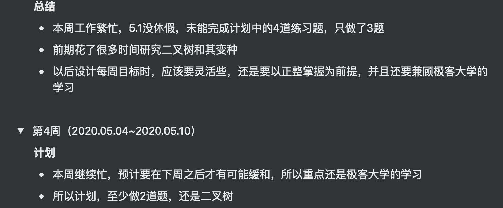

# 第4周学习总结
[TOC]
## 重学 JavaScript | 结构化

### 参考名词：

OC：[ Objective-C ](https://zh.wikipedia.org/wiki/Objective-C)是一种通用、高级、面向对象的编程语言。它扩展了标准的 ANSI C 编程语言，将 Smalltalk 式的消息传递机制加入到 ANSI C 中。当前主要支持的编译器有 GCC 和 Clang（采用 LLVM 作为后端）。

### 笔记

#### 事件循环

* 事件循环是浏览器执行任务的机制，它会不断循环判断消息队列中是否有任务，队列中的任务都是指宏任务，而宏任务中包含微任务队列，在宏任务结束前后执行微任务队列，知道微任务队列中为空才结束这个宏任务。
* 事件循环不属于JavaScript引擎实现的东西，而是由浏览器或node js宿主环境实现的

#### 宏任务与微任务

- 宏任务是消息队列中的一个task，它可能是由用户交互、资源加载、script、web api（setTimeout, setInterval, setImmediate等）等所产生的

* setTimeout会产生宏任务
* 微任务是宏任务中的一个子任务组，在宏任务结束前执行，为什么会有微任务的出现？因为在消息队列中无法根据优先级来执行任务，导致实时性较高的任务无法立即执行，像监听DOM元素的MutationObserve等，Promise.resolve 和 Promise.reject 都会产生一个微任务。微任务中也有可能产生一个微任务，当所以微任务执行完成才会结束当前的宏任务。
* 列表里的所有微任务执行完才会执行下一个宏任务
* Promise的then方法以及async函数里的await会将一个微任务入队，微任务列表里的微任务按入队顺序执行

#### 代码示例

```javascript
async function afoo(){
    console.log("1");
    await new Promise(resolve => resolve());
    console.log("2");
}

new Promise(resolve => (console.log("3"), resolve()))
    .then(()=>(
        console.log("4"), 
        new Promise(resolve => resolve())
            .then(() => console.log("5")) ));

setTimeout(function(){
    console.log("6");
    new Promise(resolve => resolve()) .then(console.log("7"));
}, 0);
console.log("8");
console.log("9");
afoo();

// 3
// 8
// 9
// 1
// 4
// 2
// 5
// 6
// 7
```

## 算法训练小组

总结&计划 https://www.notion.so/0d596f26a24d4ae9b22e8268fca5816d



