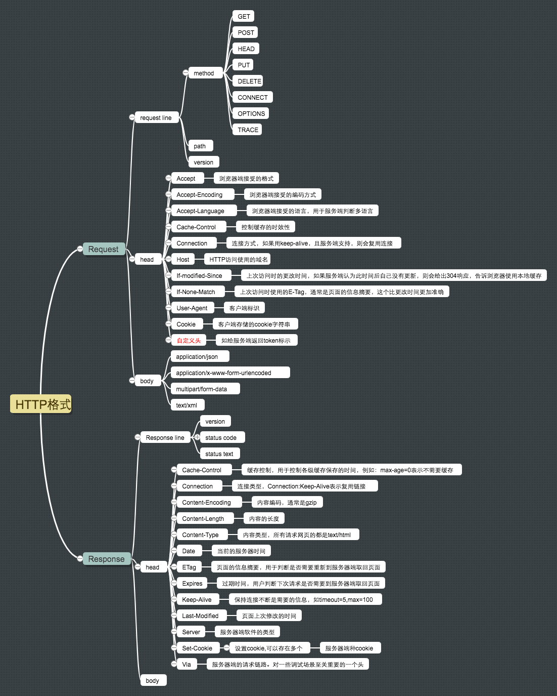

# 第 5 周学习总结

## 浏览器原理相关课程

> 本周教学进度没有同步教学大纲
> 

[浏览器：一个浏览器是如何工作的？（阶段一）](https://time.geekbang.org/column/article/80240)
[浏览器：一个浏览器是如何工作的？（阶段二）](https://time.geekbang.org/column/article/80260)
[Node.js http](http://nodejs.cn/api/http.html)
[Node.js net](http://nodejs.cn/api/net.html#net_net_createconnection_options_connectlistener)
[rfc2616](https://tools.ietf.org/html/rfc2616)
